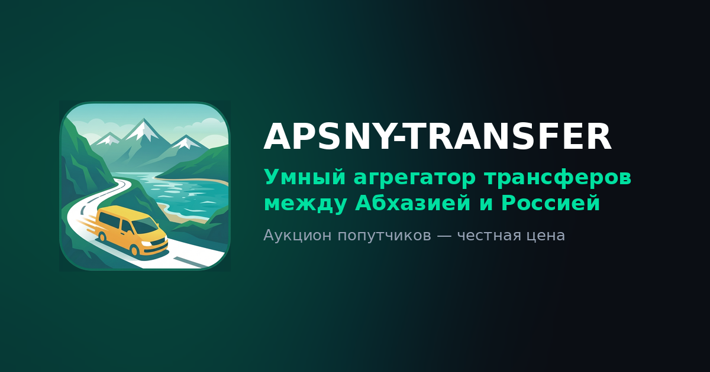
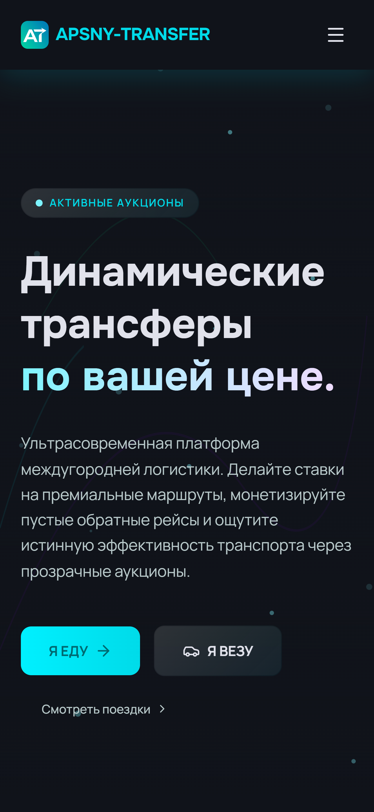
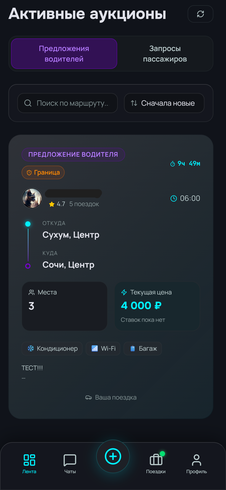
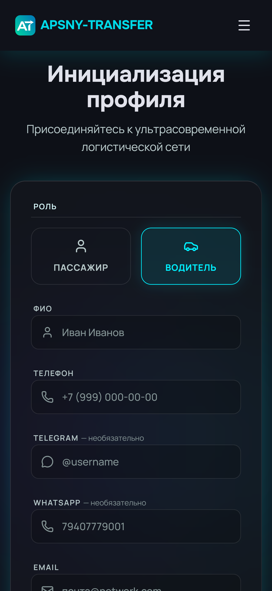

<p align="center">
  
</p>

<h1 align="center">APSNY-TRANSFER</h1>

<p align="center">
  <b>Умный агрегатор трансферов между Абхазией и Россией</b><br>
  Аукционная площадка попутных поездок по маршрутам Сочи&nbsp;↔&nbsp;Абхазия — честная цена через обратный аукцион.
</p>

<p align="center">
  <a href="https://apsny-transfer.vercel.app/"><b>🌐 Открыть сайт</b></a>
</p>

<p align="center">
  
  
  
  
  
  
</p>

---

## О проекте

**APSNY-TRANSFER** — это онлайн-площадка, которая сводит пассажиров и водителей для совместных
поездок между Абхазией и Россией. Вместо фиксированных тарифов цену определяет **обратный аукцион**:
одна сторона публикует поездку, другая делает ставки, а по завершении аукциона стороны получают
контакты друг друга и договариваются напрямую.

Сервис является **информационной площадкой** и не выступает перевозчиком или стороной сделки.

## 📸 Скриншоты

<p align="center">
  
  &nbsp;
  
  &nbsp;
  
</p>

## ✨ Возможности

- 🔁 **Обратный аукцион** — стартовая цена, шаг ставки и длительность задаёт автор поездки.
- 🧍 **Две роли** — пассажир («запрос») и водитель («предложение»), у каждой свой сценарий.
- 💳 **Платная публикация** — размещение поездки стоит 100 ₽ (оплата картой через ЮMoney).
- 🧾 **Квитанция об оплате** — печать или сохранение в PDF прямо в приложении.
- 💬 **Сообщения и чаты** между участниками после завершения аукциона.
- ⭐ **Рейтинги и отзывы** водителей.
- 🚗 **Профиль водителя** с автомобилями и удобствами поездки.
- 🔔 **Telegram-уведомления** администратору об оплатах и ошибках.
- 📱 **PWA** — устанавливается как приложение, адаптивный интерфейс.

## 🧭 Как это работает

1. Пользователь регистрируется и выбирает роль — водитель или пассажир.
2. Создаёт поездку: маршрут, дату, цену, шаг ставки и длительность аукциона.
3. Нажимает **«Оплатить и опубликовать — 100 ₽»** — поездка создаётся как черновик.
4. После подтверждённой оплаты поездка публикуется, и запускается таймер аукциона.
5. Участники делают ставки; по окончании определяется победитель.
6. Сторонам открываются контакты — дальше они договариваются напрямую.

## 💳 Оплата публикации

Оплата реализована на **ЮMoney QuickPay** (приём банковских карт, включая МИР) с серверным
подтверждением через **Supabase Edge Function**:

```
Клиент → создаёт черновик (status='draft')
       → RPC start_ride_payment() выдаёт уникальную метку (label)
       → редирект на оплату ЮMoney
ЮMoney → HTTP-уведомление → Edge Function yoomoney-webhook
       → проверка подписи HMAC-SHA256 и суммы
       → RPC publish_ride_paid(): draft → active, старт аукциона
```

Подтверждение оплаты выполняется только на сервере, поэтому опубликовать поездку в обход оплаты нельзя.

## 🛠 Технологии

- **Frontend:** React 19, TypeScript, Vite, React Router, Tailwind CSS, Motion, lucide-react
- **Backend:** Supabase (PostgreSQL + RLS, RPC `SECURITY DEFINER`, Edge Functions на Deno)
- **Платежи:** ЮMoney QuickPay + вебхук с проверкой подписи
- **Автоматизация:** pg_cron (очистка черновиков), pg_net + Telegram Bot API (уведомления)
- **Хостинг:** Vercel (SPA) + Supabase

## 📁 Структура проекта

```
apsny-transfer/
├─ src/
│  ├─ pages/          # экраны (Лента, Создание, Оплата, Квитанция, Профиль, инфо-страницы…)
│  ├─ components/     # переиспользуемые компоненты и лейауты
│  ├─ context/        # React-контексты (тосты и т.п.)
│  └─ lib/            # клиент Supabase, оплата ЮMoney, реквизиты сайта
├─ supabase/
│  ├─ functions/      # Edge Functions (yoomoney-webhook)
│  └─ migrations/     # SQL-миграции схемы и логики
├─ public/            # PWA-манифест, иконки, og-image, robots/sitemap
├─ CHANGELOG.md       # журнал изменений проекта
└─ README.md
```

## 🚀 Локальный запуск

Нужны **Node.js 18+** и проект Supabase.

```bash
# 1. установить зависимости
npm ci

# 2. создать .env по образцу и заполнить (см. ниже)
cp .env.example .env

# 3. запустить дев-сервер
npm run dev

# сборка production
npm run build

# проверка типов
npm run lint
```

## 🔑 Переменные окружения

| Переменная | Назначение |
| --- | --- |
| `VITE_SUPABASE_URL` | URL проекта Supabase |
| `VITE_SUPABASE_ANON_KEY` | Публичный anon-ключ Supabase |
| `VITE_YOOMONEY_RECEIVER` | Номер кошелька ЮMoney для приёма оплаты |

> Секрет проверки подписи вебхука (`YOOMONEY_NOTIFICATION_SECRET`) и токены Telegram
> хранятся **на стороне Supabase** (Edge Function Secrets / Vault), а не в коде и не в `.env`.

## ☁️ Деплой

- **Frontend** автоматически собирается и публикуется на **Vercel** при пуше в `main`.
- **Edge Function** деплоится в Supabase; схема и логика — через SQL-миграции в `supabase/migrations`.
- Вебхук ЮMoney указывает на адрес Edge Function `yoomoney-webhook`.

## 📄 Документы

Публичные страницы сервиса: «О проекте», «Платные услуги», «Условия использования» (оферта),
«Политика конфиденциальности», «Контакты».

История изменений проекта — в [CHANGELOG.md](CHANGELOG.md).

## 📬 Контакты

По всем вопросам — электронная почта: **mincorey@internet.ru**

---

<p align="center">© 2026 APSNY-TRANSFER. Все права защищены.</p>
